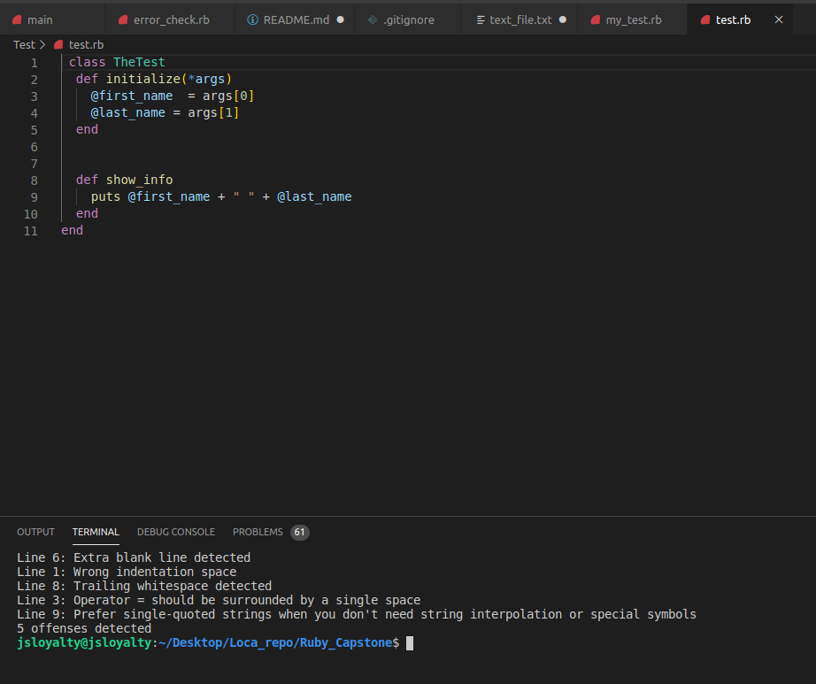
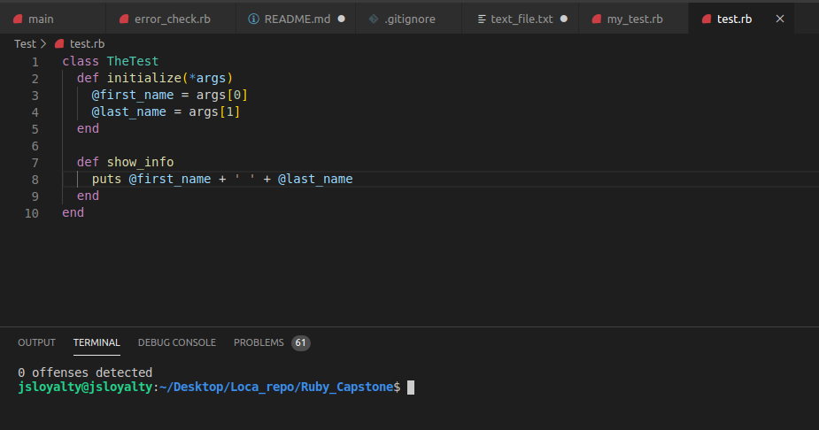

# Ruby_Capstone

In this project, I build a linter for Ruby that can detect some errors within your ruby code according to ruby syntax rules.

<!--
*** Thanks for checking out this README Template. If you have a suggestion that would
*** make this better, please fork the repo and create a pull request or simply open
*** an issue with the tag "enhancement".
*** Thanks again! Now go create something AMAZING! :D
-->

<!-- PROJECT SHIELDS -->
<!--
*** I'm using markdown "reference style" links for readability.
*** Reference links are enclosed in brackets [ ] instead of parentheses ( ).
*** See the bottom of this document for the declaration of the reference variables
*** for contributors-url, forks-url, etc. This is an optional, concise syntax you may use.
*** https://www.markdownguide.org/basic-syntax/#reference-style-links
-->

[![Contributors][contributors-shield]][contributors-url]
[![Forks][forks-shield]][forks-url]
[![Stargazers][stars-shield]][stars-url]
[![Issues][issues-shield]][issues-url]

<!-- PROJECT LOGO -->
<br />
<p align="center">
  <a href="https://github.com/jstloyal/Ruby_Capstone">
    
  </a>
  
  <h3 align="center">Ruby Linter</h3>
  
  <p align="center">
    This project is part of the Microverse curriculum in Ruby module!
    <br />
    <a href="https://github.com/jstloyal/Ruby_Capstone"><strong>Explore the docs »</strong></a>
    <br />
    <br />
    <a href="https://repl.it/@ioanniskousis/Ruby_Capstone">View Demo</a>
    <a href="https://github.com/jstloyal/Ruby_Capstone/issues">Report Bug</a>
    <a href="https://github.com/jstloyal/Ruby_Capstone/issues">Request Feature</a>
  </p>
</p>

<!-- TABLE OF CONTENTS -->

## Table of Contents

- [About the Project](#about-the-project)
- [Built With](#built-with)
- [Live Version](#live-version)
- [Acknowledgements](#acknowledgements)
- [License](#license)

<!-- ABOUT THE PROJECT -->

## About The Project

The project consists of four code files

- The 'bin' folder

* main
  The main is the executable file that controls lint logic.

- The 'lib' folder

* error_check.rb
  This class checks for mistakes within the code. Different methods are used to do this checks.

- The 'Test' folder

* test.rb
  This short program is used to test our small linting program and see how it responds when a file is passed for error checks.

* my_test.rb
  This medium program is used to test our small 'linting' program and see how it responds when a file is passed for error checks.

<!-- ABOUT THE PROJECT -->

## How to run the linter

- clone the project and add the file or files to be linted in the project directory.
- excecute the main.rb file inside bin/main.
- Specify the path to the file when prompted.
- The ruby file will run only if the path given is correct!

## Development

- Clone the project

```
https://github.com/jstloyal/Ruby_Capstone.git
```

- Run the Application

## Bad Code

- first_name = args[0] - Operator = should be surrounded by a single space
- last_name = args[1] - Trailing space error

<p align="center">
    
</p>

## Good Code

<p align="center">
    
</p>

### Built With

This project was built using these technologies.

- Ruby
- Rubocop
- VsCode
- Git-Flow

<!-- LIVE VERSION -->

## Live version

You can see it working []()

<!-- CONTACT -->

## Contributors

:bust_in_silhouette:
**Author_1**

​## Adetayo Sunkanmi

- Github: [@jstloyal](https://github.com/jstloyal)
- Twitter: [@jstloyalty](https://twitter.com/jstloyalty)
- Linkedin: [Adetayo Sunkanmi](https://www.linkedin.com/in/jstloyalty)
- E-mail: jstloyalty@gmail.com

<!-- ACKNOWLEDGEMENTS -->

## Acknowledgements

- [Microverse](https://www.microverse.org/)
- [The Odin Project](https://www.theodinproject.com/)
- [Ruby Documentation](https://www.ruby-lang.org/en/documentation/)

<!-- MARKDOWN LINKS & IMAGES -->
<!-- https://www.markdownguide.org/basic-syntax/#reference-style-links -->

[contributors-shield]: https://img.shields.io/github/contributors/jstloyal/Ruby_Capstone.svg?style=flat-square
[contributors-url]: https://github.com/jstloyal/Ruby_Capstone/graphs/contributors
[forks-shield]: https://img.shields.io/github/forks/jstloyal/Ruby_Capstone.svg?style=flat-square
[forks-url]: https://github.com/jstloyal/Ruby_Capstone/network/members
[stars-shield]: https://img.shields.io/github/stars/jstloyal/Ruby_Capstone.svg?style=flat-square
[stars-url]: https://github.com/jstloyal/Ruby_Capstone/stargazers
[issues-shield]: https://img.shields.io/github/issues/jstloyal/Ruby_Capstone.svg?style=flat-square
[issues-url]: https://github.com/jstloyal/Ruby_Capstone/issues

<!-- LICENSE -->

## License

📝
This project is [MIT](https://opensource.org/licenses/MIT) licensed.
